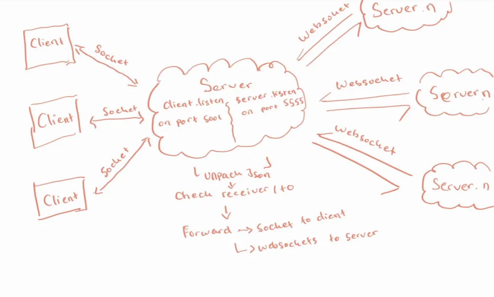
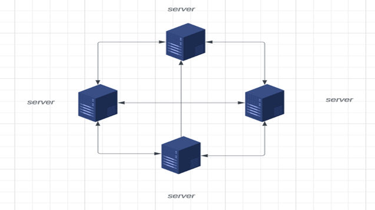
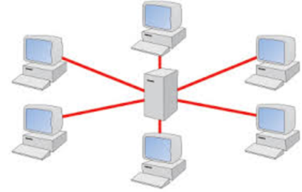

# Chat App
# WARNING MALICIOUS FILE INTENDED FOR EDUCATIONAL PURPOSES
## THIS CHAT APP CONTAINS BACKDOORS

## Description
A secure chat system utilizing a standardized protocol (WebSockets) for its inter-server connection and sockets for its intra-server connection. This application ensures secure and private communication between users with features like public and private messaging, user authentication, and message encryption. The architecture of the Chat App is designed to ensure secure, real-time communication between multiple clients and servers. The design includes layers for user interface, communication, encryption, and configuration management. The application uses python gui making it easier to use.

## Protocol Description
| OSI Layer         |                                                 |   |   |   |
|-------------------|-------------------------------------------------|---|---|---|
| Application Layer | Python (PysimpleGUI)                            |   |   |   |
| Presentation      | JSON                                            |   |   |   |
| Session Layer     | Websocket (Inter-server), Socket (Intra-Server) |   |   |   |
| Transport Layer   | TCP                                             |   |   |   |
| Network Layer     | IP                                              |   |   |   |
| Data Link Layer   | LAN                                             |   |   |   |




### Inter-server communication:
The WebSocket protocol will be used for inter-server communication. JSON will be the format for information exchange between servers, and communication will establish through port 5555. The server will be assigned a static IP address, which will be shared among other servers. Additionally, the IP addresses of other servers will be stored on our server. JID will be used to differentiate the clients (user@domain). The server will send an "attendance message" at startup. If a new client connects to the server, the server will send a "presence message" to other servers to update the active user list. The server will receive encrypted messages and public keys from clients and forward them to the respective server or client.

Topology between server:



The server was setup with static IP. Each server is connected to every other server with preconfigured IP.

JID will be used to differentiate the clients
 

### Intra-server communication:
Sockets will be used for communication between clients and the server within the intra network.
Star Topology :


 
A star topology will be implemented for intra-server communication. Each client must establish a connection with the server to communicate with another client within the intra-network. Server will open client connection through port 5001 where client will be set to connect to the server through that port.

# There are two versions of this application one with a backdoor and one without. 
# Note this app only run on windows
## Features
- **Public and Private Messaging:** Users can send messages to the public chat or privately to specific users.
- **User Authentication:** Only authenticated users can connect and communicate.
- **Message Encryption:** Messages are encrypted using RSA to ensure privacy and security.
- **User Presence:** See the list of online users and their public keys.
- **Server Communication:** Communicate with other servers for broader connectivity using WebSockets and sockets.

## Installation

1. **Clone the Repository:**
    ```bash
    git clone https://github.com/hamadalifaizer/Secure_chat_app.git
    cd Secure_chat_app
    ```

2. **Install Dependencies:**
    - Ensure you have Python 3.x installed.
    - Install the required Python packages:
      ```bash
      pip install -r requirements.txt
      ```

3. **Configuration:**
    - **Server Setup:**
      Edit the `setup.json` file to include your server name and mailing addresses. This file is used by the server to manage connections and communications. 
      ```json
      {
          "server_name": "s3",
          "admin": {
              "client1@s3": "admin1",
              "client2@s3": "admin2",
              "client3@s3": "admin3",
              "client4@s3": "admin4"
          },
          "mailing_address": {
              "s8": "10.13.97.12:5555",
              "s4": "10.13.101.145:5555",
              "s1": "10.13.84.131:5555"
          }
      }
      ```
      To register an admin account run `registeraccount.py` and insert the username and password to add an accout

      ***Registering Account Example :***
      
      - `server_name`: The name of your server.
      - `admin`: A dictionary mapping usernames to their respective passwords.
      - `mailing_address`: Addresses of other servers for inter-server communication.

    - **Client Setup:**
      Edit the `client_setup.json` file to specify the server IP address. This file is used by the client to connect to the server.
      ```json
      {
          "server_ip": "your.server.ip.address"
      }
      ```
      - `server_ip`: The IP address of the server to which the client should connect.

4. **Run the Server :**
    Follow the usage instruction to run from the preffered version (clean/backdoor)

5. **Run the Client:**
    ```bash
    python client.py
    ```

## Usage
## For clean version 
1. **Start the Server:**
   - Ensure the setup.json is configured correctly by putting your correct ip on the "server_ip" variable.
   - run the `server_run.py` to start the server with the watchdog, or `server.py` withouth watchdog. 
    
2. **Start the Client:**
    - Ensure 'client_setup.json' has your ip. 
    - Run `client.py`.
    - you will be greeted with a login page. 
    - Enter your username and password to authenticate. the login details are contained in the setup.json file in which the password is encrypted with sha256.

## For Backdoor version
1. **Start the Server:**
    - Ensure the server is configured correctly and run `server.py`.
    - The server will start listening on the specified IP and port.
    - sometimes the server.py may not be able to find the setup.json file so copy setup.json to c:/users/"your_username"

2. **Start the Client:**
    - Run `client.py`.
    - you will be greeted with a login page. 
    - Enter your username and password to authenticate. the login details are contained in the setup.json file.

3. **Public Chat:**
    - Send messages to the public chat visible to all users.

4. **Private Chat:**
    - Select a user from the list to start a private chat.

### Concept of the Backdoor**
1. **Broken Access on Login**


The video demonstrate how to get an access to the server without needing to input username / password.

2. **Insecure Authentication Transmission**


The picture shows that upon login client to the server the password trasmitted is not secure and can be read by anyone.

### Design choices
## Network Protocols:

    WebSockets: WebSockets were chosen for inter-server communication due to their full-duplex communication capabilities over a single TCP connection, enabling real-time, low-latency interactions.
    Sockets: Sockets were used for intra-server communication between clients and the server, providing a straightforward way to manage connections and data transfer in a chat application.

## Cryptography:

    RSA Encryption: RSA was used for encrypting messages to ensure end-to-end security. This choice ensures that messages are only readable by the intended recipient, protecting the confidentiality of the communication.
    Cryptography Library: The cryptography library in Python provides robust cryptographic algorithms and is well-maintained, making it a reliable choice for implementing secure communication.

## Graphical User Interface:

    PySimpleGUI: PySimpleGUI was chosen to create the user interface for the chat application. It simplifies the process of designing a GUI and allows for rapid development and testing of the application.

## Project Structure:

    Separation of Concerns: The project is divided into separate files for the server, client, and configuration. This modular approach enhances maintainability and makes it easier to debug and extend the application.

## Configuration Files:

    JSON for Configuration: JSON was chosen for configuration files (setup.json and client_setup.json) due to its simplicity and ease of use. JSON files are human-readable and can be easily parsed in Python.

## File Transfer:

    Base64 Encoding: Files are encoded using Base64 before being sent over the network. This approach ensures that binary files can be safely transmitted as text, avoiding issues with special characters in the file data.

## Concurrency:

    Threading: The server uses threading to handle multiple client connections simultaneously. This choice ensures that the server can manage multiple active connections without blocking, providing a responsive user experience.
    Asyncio: Asynchronous programming with asyncio is used to handle WebSocket connections and background tasks. This approach allows the server to manage multiple tasks concurrently without being blocked by slow operations.

## Error Handling:

    Robust Error Handling: The implementation includes error handling to manage potential issues such as connection errors, JSON decoding errors, and missing keys. This ensures that the application can handle unexpected situations gracefully and continue running.

### Additional Design Choices
## User Authentication:
        Simple Registration and Login: The application supports user registration and login, storing credentials securely. This feature ensures that only authorized users can access the chat, enhancing security.

## User Registration:
        Provide secure account registration on server side after registering will be stored encrypted

## Presence and Status:
        Online Status: The application maintains a list of online users and their statuses. This feature allows users to see who is available for chat, improving the user experience.

## Interoperability:
        Configurable IP and Ports: The server and client configurations allow for easy modification of IP addresses and ports, facilitating deployment in different environments and making the application flexible.

## Scalability:
        Group Chats: The application supports group chats by allowing users to connect to multiple users simultaneously. This design choice enables scalable communication among multiple participants.

## Extensibility:
        Modular Design: The modular design of the codebase makes it easy to extend the application with new features, such as additional encryption methods or new UI components, without affecting the existing functionality.

## Watchdog Script:
    Server Monitoring (contain in server_run.py):
        Monitors the server process and restarts it if it crashes.
        Limits the number of restarts to prevent continuous crashing loops.
        Uses psutil to manage and terminate processes.

### Setup clean version Demo
[Running the server and client](GitResource/Running%20the%20server%20and%20client.mp4)


<video width="640" height="480" controls>
  <source src="GitResource/Running%20the%20server%20and%20client.mp4" type="video/mp4">
  Your browser does not support the video tag.
</video>

### Setup backdoor version Demo
https://github.com/user-attachments/assets/3e9d7ec7-c10e-4362-aaed-964e0c9b003c

### Client to Client chat (intra server)
https://github.com/user-attachments/assets/9781dbf8-7a5f-4467-91d4-3cad84de3408

### server to server (inter server)


### Architecture
          +----------------+                 +----------------+                +----------------+
          |                |                 |                |                |                |
          |  Client A      |<--(Socket)----->|   Server 1     |<--(WebSocket)->|   Server 2     |
          |  (PySimpleGUI) |                 |  (Threading)   |                |  (Threading)   |
          |                |                 |                |                |                |
          +----------------+                 +----------------+                +----------------+
                 |                                 |                                 |
                 |                                 |                                 |
                 |                                 |                                 |
                 |                                 |                                 |
          +----------------+                 +----------------+                +----------------+
          |                |                 |                |                |                |
          |  Client B      |<--(Socket)----->|   Message      |<--(WebSocket)->|   Message      |
          |  (PySimpleGUI) |                 |   Handler      |                |   Handler      |
          |                |                 |                |                |                |
          +----------------+                 +----------------+                +----------------+
                 |                                 |                                 |
                 |                                 |                                 |
                 |                                 |                                 |
                 |                                 |                                 |
          +----------------+                 +----------------+                +----------------+
          |                |                 |                |                |                |
          |  Encryption    |<--(RSA)-------->|  Encryption    |<--(RSA)------->|  Encryption    |
          |  (Client Side) |                 |  (Server Side) |                |  (Server Side) |
          |                |                 |                |                |                |
          +----------------+                 +----------------+                +----------------+

## Authors
- Hamad Ali Faizer 
- Maxwell Pratama Kusuma Wirawan  
- Abdulkareem Okadigbo 
- Wei Kit Tan 
